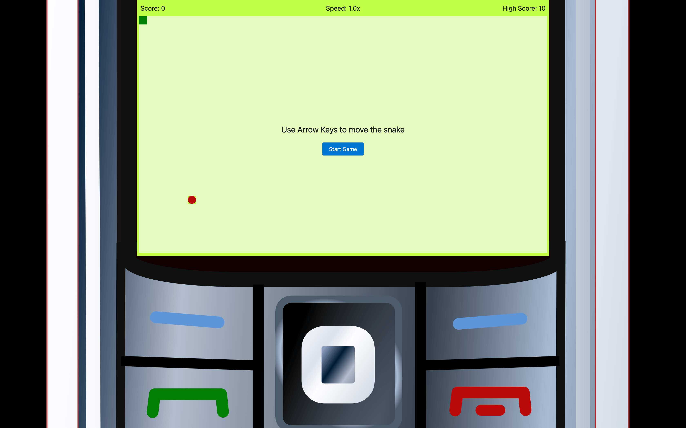

# 🐍 LWC OSS Snake Game


The project was born out of pure interest in using Lightning Web Components outside of the Salesforce platform.
I was inspired to the Snake idea by the following blog article and reused some of the game code:

[How to Build the Snake Game Using Lightning Web Components](https://developer.salesforce.com/blogs/2020/09/how-to-build-the-snake-game-using-lightning-web-components)

If you are also interested in LWC OSS you can find more info here: https://lwc.dev/

## Preview



## Project Setup

The directory structure looks like this:

```
src/
  ├── assets/           // static assets
  │   └── fonts/
  │   └── icons/
  │   └── images/
  │   └── styles/
  |   └── favicon.ico
  └── layouts/          // lwc layouts
  │   └── main.html
  └── modules/          // lwc modules
      └── snake/
          └── app/
              ├── app.css
              ├── app.html
              └── app.js
          └── game/
              ├── game.css
              ├── game.html
              └── game.js
lwr.config.json         // lwr configuration
package.json            // npm packaging configuration
```

## Configuration

The LWR server is configured in `lwr.config.json`, at the root of the project. It has two LWC module and one server-side route.

```json
{
  "lwc": { "modules": [{ "dir": "$rootDir/src/modules" }, { "npm": "lightning-base-components" }] },
  "routes": [
    {
      "id": "snake",
      "path": "/",
      "rootComponent": "snake/app",
      "layoutTemplate": "$layoutsDir/main.html",
      "bootstrap": {
        "syntheticShadow": true
      }
    }
  ],
  "assets": [
    {
      "alias": "assetsDir",
      "dir": "$rootDir/src/assets",
      "urlPath": "/assets"
    },
    {
      "dir": "$rootDir/src/assets/fonts",
      "urlPath": "/fonts"
    },
    {
      "alias": "favicon",
      "file": "$rootDir/src/assets/favicon.ico",
      "urlPath": "/favicon.ico"
    }
  ]
}
```

## Running Linter and Prettier

Run _Prettier_ to check all files for formatting issues:

```
yarn run prettier
```

Run _ESLint_ to check for linting issues:

```
yarn run lint
```

## Running the Project in Dev Mode

Install all required dependencies:

```
yarn install
```

Start the local development server:

```
yarn dev
```

Open the site at [http://localhost:3000](http://localhost:3000)

## Statically Generate and Preview the Site

Build the project:

```
yarn build
```

Preview the generated site:

```
yarn start
```

Open the site at [http://localhost:3000](http://localhost:3000)
